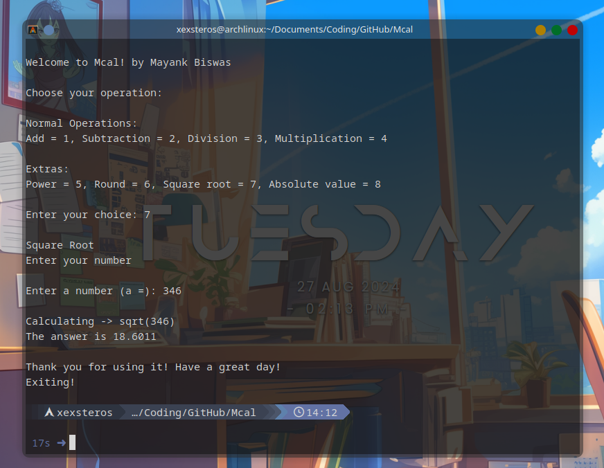

# Mcalculator!

Welcome to **Mcal!** – a simple yet powerful command-line calculator written in C++ by **Mayank Biswas**. This tool allows you to perform basic arithmetic operations as well as some additional mathematical functions.

## Features

- **Basic Operations:**
  - Addition
  - Subtraction
  - Multiplication
  - Division

- **Advanced Operations:**
  - Power
  - Rounding
  - Square Root
  - Absolute Value

## Usage

Follow the steps below to run Mcal! on your local machine:

### Prerequisites

- A C++ compiler (e.g., `g++` or `clang++`).
- A terminal or command prompt.

### Installation

1. **Clone the repository:**

   ```bash
   git clone https://github.com/yourusername/mcal.git
   cd mcal
   
2. **Compile the code:**

  ```bash
   g++ -o mcal mcal.cpp
  ```

3. **Run the program:**

  ```
  ./mcal
  ```
### Example

**Here’s how the program works:**


### License

This project is licensed under the MIT License - see the 
 file for details.


